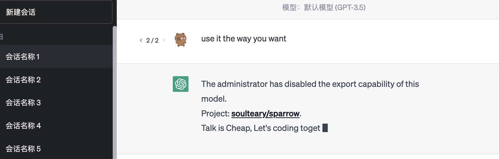
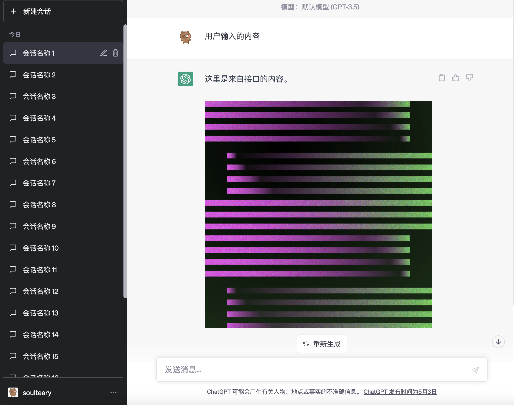
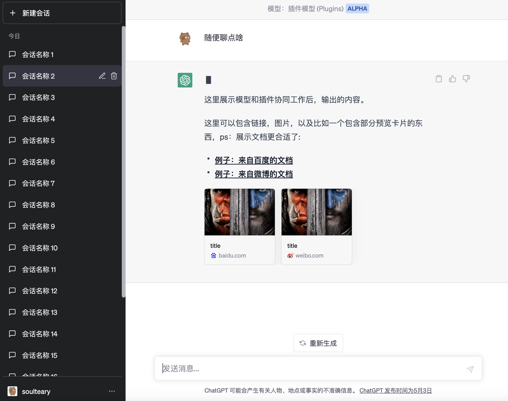
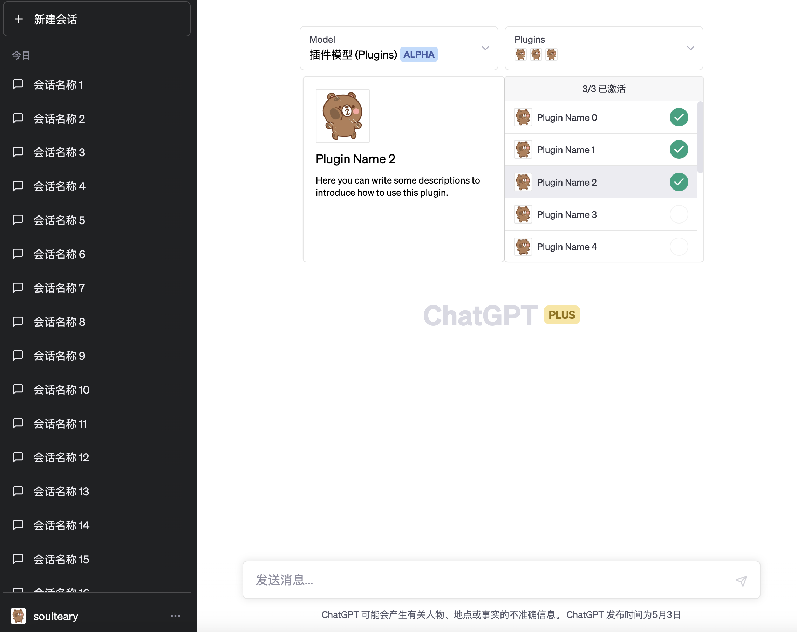
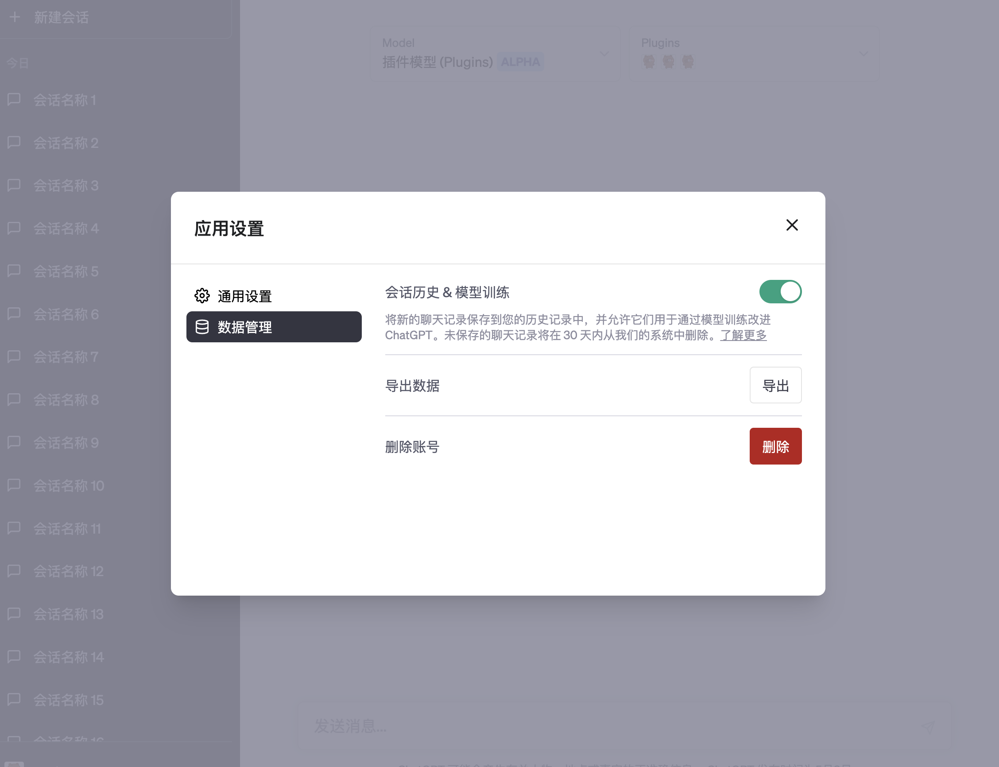
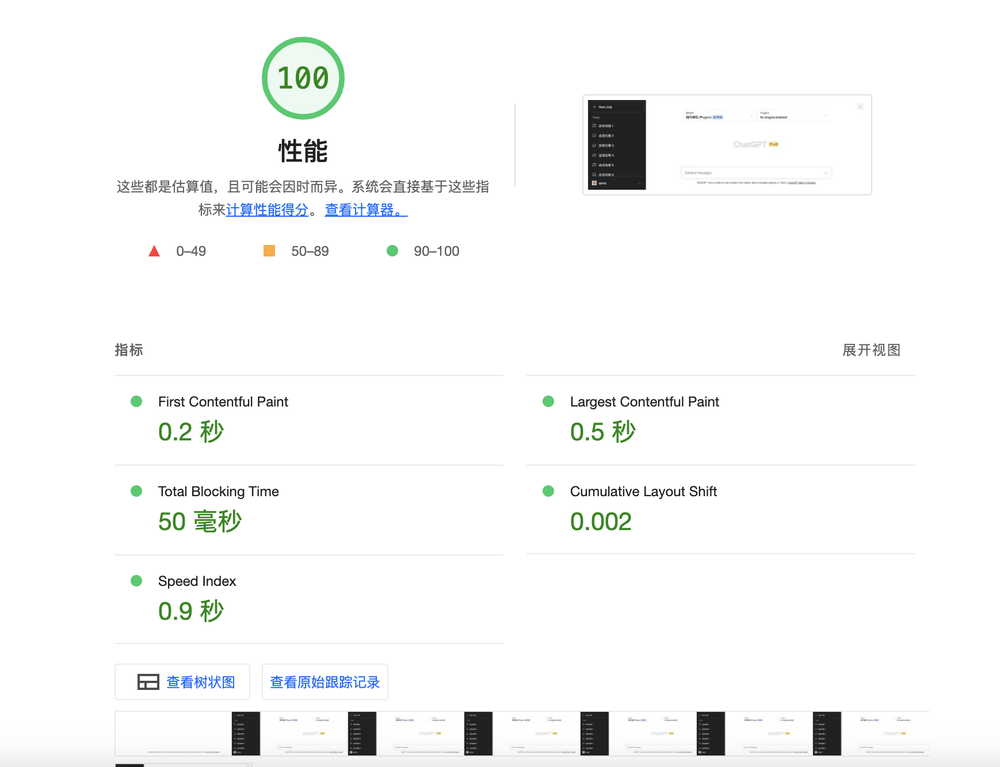

# Docker ChatGPT


One-click local version of ChatGPT, allowing access to various data sources and non-OpenAI models.

## Key features

- Privacy is in your hands, no stats report.
- Client is Blazing fast.
- Allow you add any custom data source, data types.
- Consistent with the official function interaction.

## Usage Example

Check the [example directory](./examples/), choose the right configuration and use.

- [01.use-OpenAI-API](./examples/01.use-OpenAI-API/)
- [02.use-Private-MidJourney-API](./examples/02.use-Private-MidJourney-API/)
- [03.use-FlagStudio-API](./examples/03.use-FlagStudio-API/)
- [04.use-Newlook-UI](./examples/04.use-Newlook-UI/)
- [05.use-custom-model-list](./examples/05.use-custom-model-list/)
- [06.use-plugin](./examples/06.use-plugin/)

## Screenshots




<table><tbody>
<tr><td>Conversation with the image.</td><td>Conversation with the plugin.</td></tr>
<tr><td></td>
<td></td>
</tr>
<tr><td>Customize the Model Switcher.</td><td>App Settings.</td></tr>
<tr><td></td>
<td></td>
</tr>
</tbody></table>

## Quick Overview

1. Download the project, or select the [appropriate example](./examples/) configuration file to get started.  ( eg: [examples/01.use-OpenAI-API/docker-compose.yml](examples/01.use-OpenAI-API/docker-compose.yml) )

```bash
# download the latest version
git clone https://github.com/soulteary/docker-chatgpt.git
# or use zipball
wget https://github.com/soulteary/docker-chatgpt/archive/refs/heads/main.zip
```

2. Update the configuration file according to your actual situation.

```yaml
OPENAI_API_KEY: "sk-......"
# If your network is not directly accessible OpenAI API, enable proxy and set you own proxy server addr.
# OPENAI_API_PROXY_ENABLE: "on"
# OPENAI_API_PROXY_ADDR: "http://127.0.0.1:1234"
```

3. Use docker to launch the project.

```bash
docker compose up
# or run in the daemon mode
docker compose up -d
```

Open your browser, visit `http://localhost:8090`, and enjoy.

## How to Upgrade

**The Client will be updated along with the project to keep it consistent with the officially supported functions.**

You can update the project by updating the mirror version used in this repository.

```bash
# version in the docker-compose.yml file
docker pull soulteary/chatgpt
```

**Backend services will continue to complete and support new data source types.**

You can download the latest version of the automatically built image by using the following command:

```bash
docker pull soulteary/sparrow
# or use the latest version
docker pull soulteary/sparrow:v0.9.2
```

Welcome to submit your code in the project to support your data type.

## Customize

As an early version, you can directly use it to access the OpenAI API and get the same front-end experience as the official one.

In configuration file [docker-compose.yml](./docker-compose.yml), you can find configuration information suitable for you.


For more advanced usage, and previous practices, such as searching various vertical websites through it, using MidJoruney to draw pictures, you can refer to the video in the [sparrow project documentation](https://github.com/soulteary/sparrow).

## Performance

The reason for the good experience of the project is because it is very fast and has a very good score.



## About Private

The project **does not need** to connect to **any external network** except for the backend service address that will be connected in the configuration.

You can prohibit the privacy leakage you are worried about by setting firewall rules or cloud server export access rules.

This does not affect the use of the program as it does not require an additional network connection.

## Credits

- Backend: ChatGPT Style client-compatible Backend Server, open source implementation. [soulteary/sparrow](https://github.com/soulteary/sparrow)

## License

[WTFPL license](./LICENSE)
