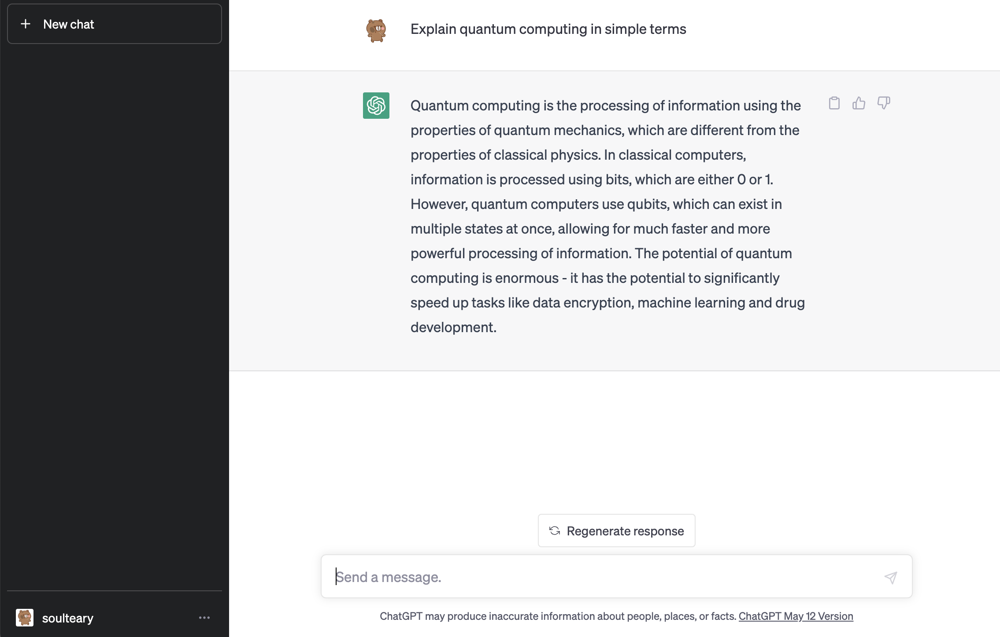
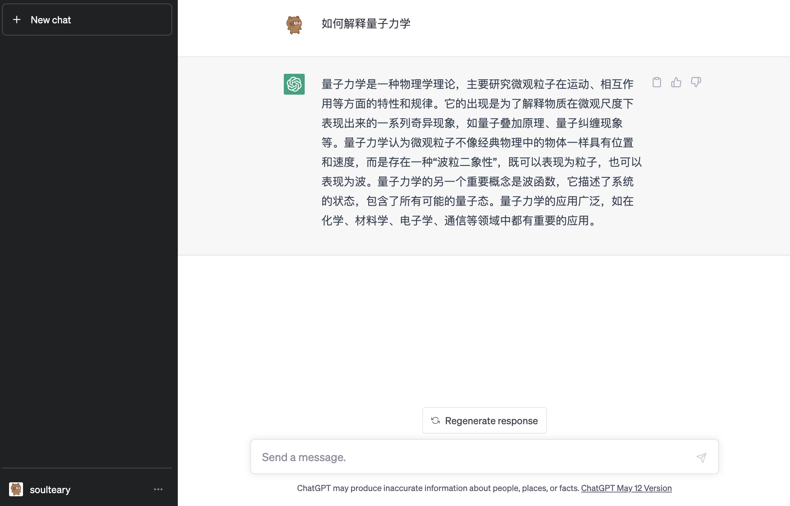

# Use the OpenAI API

How to use Openai API.

## Preparation

Register the [OpenAI](https://platform.openai.com) User, and goto the [API keys](https://platform.openai.com/account/api-keys) page, get your API key.

## Preview

English prompt test: `Explain quantum computing in simple terms.`

Chinese prompt test: `如何解释量子力学`

