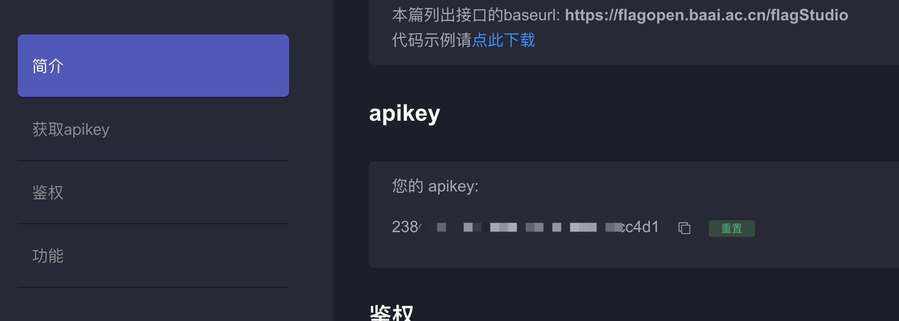
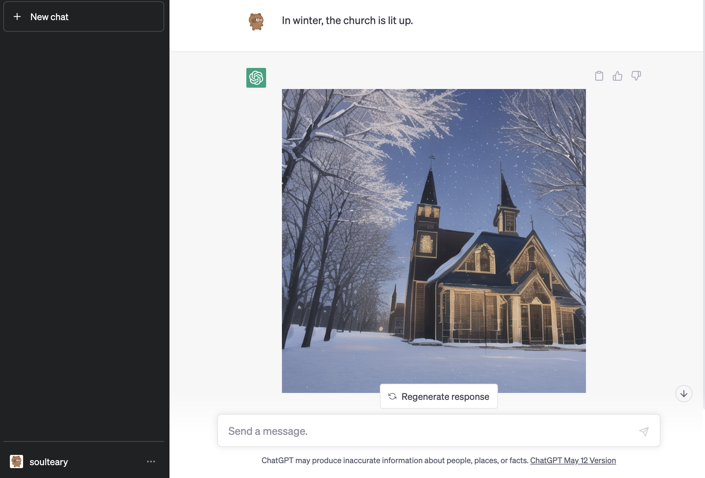
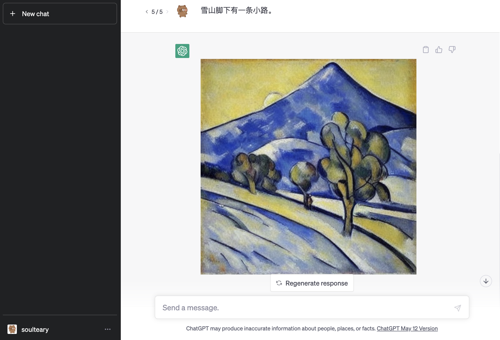

# Use the Flag Studio API

Use the new version of the look and feel.

## Preparation

Register the [Flag Studio](https://flagstudio.baai.ac.cn) User, and goto the [documentation page](https://flagstudio.baai.ac.cn/document), get your API key.

## Preview

English prompt test: `In winter, the church is lit up.`

Chinese prompt test: `雪山脚下有一条小路。`

