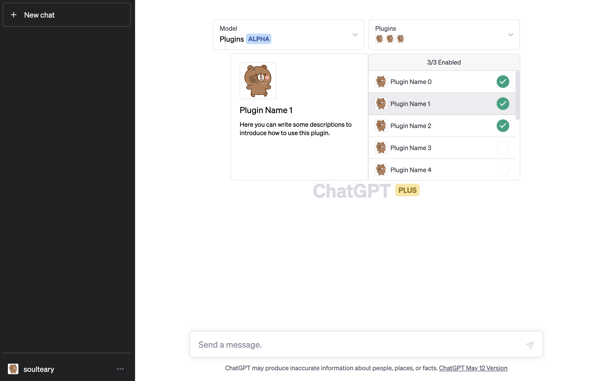
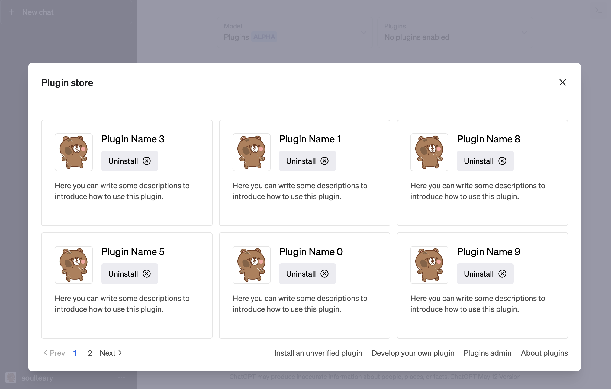
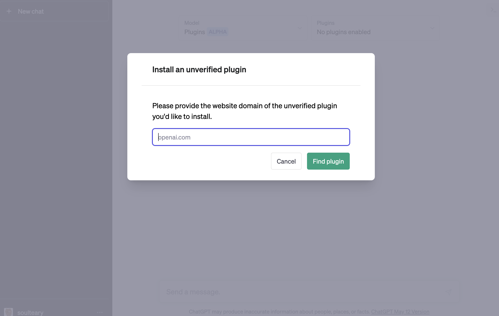
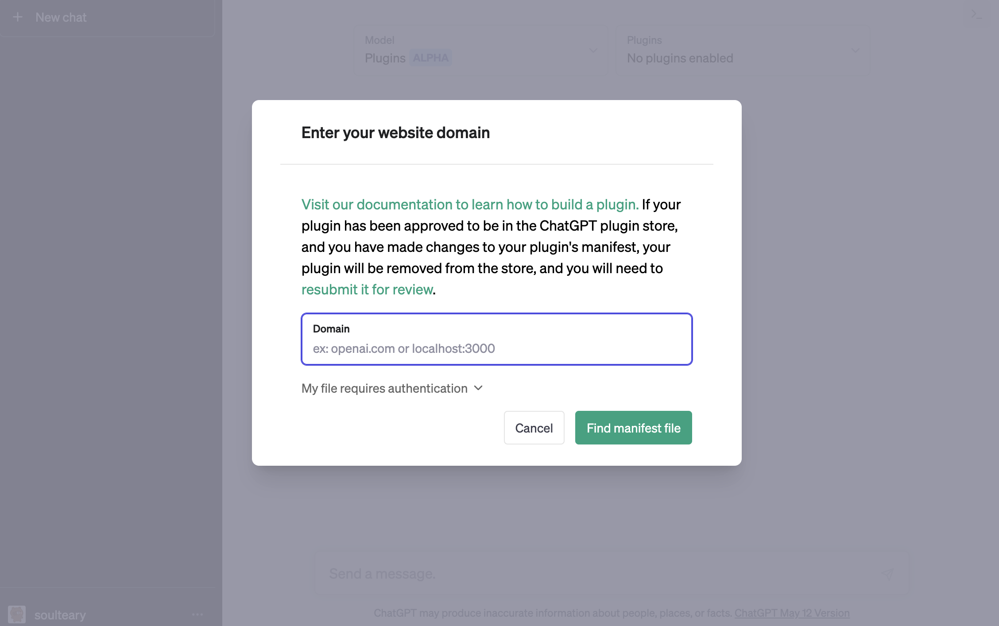
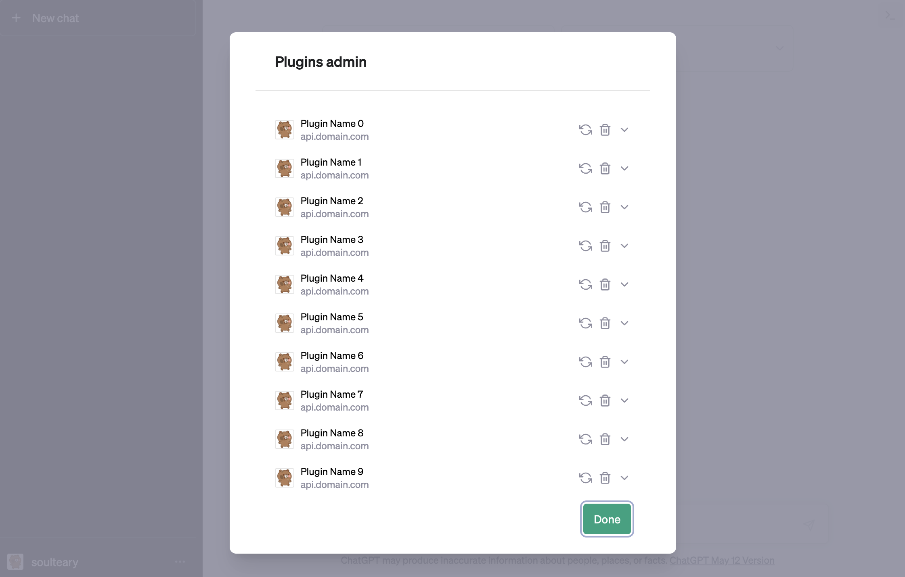

# Enable the Plugin features

Enable the plugin features, use or develop.

## Preview

Plugin store.

Install an unverified plugin.

Install an unverified plugin.

Deploy an plugin.

Plugin admin.

